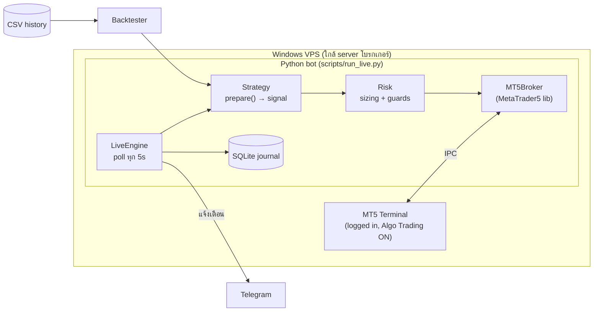

# XAUUSD Trading Bot — System Design

> เวอร์ชัน 0.1 (MVP) · 20 ก.ย. 2026 · Execution ผ่าน MetaTrader 5 (Python)

## 1. เป้าหมายและขอบเขต

**เป้าหมาย:** บอทเทรด XAUUSD อัตโนมัติ ที่ใช้โค้ด strategy/risk ชุดเดียวกันทั้งตอน backtest และตอนเทรดจริง เพื่อให้ผล backtest ใกล้ผลจริงที่สุด

**MVP (Phase 1, อยู่ใน repo นี้แล้ว)**

| รวมใน MVP | ยังไม่ทำ (Phase 2+) |
|---|---|
| 1 strategy: Asian-range breakout + trend filter | Dashboard เว็บ/แอป |
| Backtester แบบ bar-by-bar คิด spread/commission | News filter (ปฏิทินเศรษฐกิจ) |
| Risk manager: sizing ตาม % equity, daily loss limit, spread filter, max trades | Trailing stop / ปิดบางส่วน (partial close) |
| Live engine ต่อ MT5 + dry-run mode | หลาย strategy พร้อมกัน / หลายบัญชี |
| Breakeven, force-close ก่อนสิ้นวัน, kill switch | Parameter optimisation / walk-forward อัตโนมัติ |
| SQLite journal + Telegram notify | ซิงก์ผลเทรดจริงจาก MT5 history กลับเข้า journal |

## 2. สถาปัตยกรรม

**หลักการออกแบบ**

1. **Strategy เป็น pure function บน DataFrame:** `prepare(df)` คืนคอลัมน์ `signal`, `sl_dist`, `tp_dist` แบบ vectorised โดยไม่มี look-ahead ทั้ง backtest และ live เรียกฟังก์ชันเดียวกัน
2. **Broker abstraction:** engine ไม่รู้จัก MT5 โดยตรง จึงเปลี่ยนไปใช้ MetaApi / cTrader / OANDA ได้ภายหลัง และเขียน test ด้วย `FakeBroker` ได้
3. **Risk อยู่ตรงกลางเสมอ:** ทุก order ต้องผ่าน `check_guards()` และ `position_size()` ถ้าล็อตขั้นต่ำยังเสี่ยงเกินงบ จะข้ามเทรดนั้นแทนการปัดล็อตขึ้น
4. **Idempotent และทนการรีสตาร์ต:** journal บันทึก `signal_bar_utc` ไว้ ถ้าบอทรีสตาร์ตบนแท่งเดิมจะไม่ยิงซ้ำ ส่วน equity ต้นวันเก็บใน DB ไว้แล้ว daily loss จึงยังนับต่อได้
5. **Fail-safe:** error ใน loop จะถูก log แล้ววนต่อ บอทไม่ crash ถ้าสร้างไฟล์ `STOP` บอทจะหยุดเปิดออเดอร์ใหม่ทันที (ออเดอร์ที่เปิดอยู่ยังมี SL/TP ฝั่ง server คุ้มครอง)

### ทำไมเลือก Python + MetaTrader5 lib

| ทางเลือก | ข้อดี | ข้อเสีย |
|---|---|---|
| **Python + `MetaTrader5` (เลือก)** | ใช้ pandas ได้ backtest/วิเคราะห์ง่าย แชร์โค้ดกับ live และต่อ API ภายนอกสะดวก | ใช้ได้เฉพาะ Windows และต้องเปิด terminal ทิ้งไว้ |
| MQL5 EA | รันในเทอร์มินัลโดยตรง latency ต่ำสุด และมี Strategy Tester ที่ใช้ tick data | ภาษาเฉพาะทาง ต่อ DB/API ยาก และต้องเขียน logic ซ้ำสองที่ |
| MetaApi (cloud) | ใช้ REST/WebSocket จาก NestJS ได้ ไม่ต้องมี Windows | มีค่าบริการรายเดือน ต้องพึ่ง third party และ latency สูงกว่า |

ถ้าต่อไปอยากให้บอทเป็นส่วนหนึ่งของ stack NestJS ให้ Python bot ทำหน้าที่ **execution worker** แล้วส่ง event เข้า Redis / HTTP (ดู Phase 2)

## 3. โมดูลในโค้ด

| ไฟล์ | หน้าที่ |
|---|---|
| `bot/config.py` | โหลด YAML เป็น dataclass และปฏิเสธ key ที่พิมพ์ผิด |
| `bot/data.py` | โหลด CSV (ทั้ง format ของบอทและไฟล์ export จาก MT5) แล้วแปลงเวลา server เป็น UTC |
| `bot/indicators.py` | EMA และ ATR (Wilder) |
| `bot/strategy/` | `Strategy` base, registry และ `SessionBreakout` |
| `bot/risk.py` | `position_size()` และ `check_guards()` |
| `bot/backtest.py` | Backtester (spread ต่อแท่ง, equity mark-to-market) และสถิติ (PF, expectancy R, max DD, losing streak) |
| `bot/broker/mt5_broker.py` | Adapter สำหรับ MT5 (เลือก filling mode อัตโนมัติ, stops level, magic number, ตรวจ offset เวลา server) |
| `bot/engine.py` | Live loop ที่จัดการ position (breakeven, force close) และสัญญาณใหม่ |
| `bot/journal.py` | SQLite ที่เก็บ entries, day_state และ events |
| `bot/notifier.py` | Telegram |

## 4. กลยุทธ์: Asian-Range Breakout (XAUUSD, M15)

**เหตุผลเบื้องหลัง:** ทองมักแกว่งแคบช่วงเอเชีย แล้วขยายตัวเมื่อตลาดลอนดอนเปิด และอีกรอบตอน NY/ข่าว US บอทจึงเทรดตามทิศที่ราคาหลุดกรอบเอเชีย โดยเทรดเฉพาะทิศเดียวกับเทรนด์ใหญ่

| ขั้น | กฎ (เวลาเป็น UTC; เวลาไทย = UTC+7) |
|---|---|
| กรอบ | High/Low ของแท่ง 00:00–07:00 UTC (07:00–14:00 น. ไทย) |
| ช่วงเข้าเทรด | 07:00–16:00 UTC (14:00–23:00 น.) |
| Long | แท่งแรกที่ close > range high + 0.1×ATR **และ** close > EMA200 |
| Short | แท่งแรกที่ close < range low − 0.1×ATR **และ** close < EMA200 |
| กรองวัน | ข้ามวันที่กรอบแคบกว่า 1×ATR (noise) หรือกว้างกว่า 6×ATR (วิ่งไปแล้ว) |
| SL | 1.5×ATR (หรือใช้ `range` / `range_mid` ก็ได้) โดยบังคับให้อยู่ระหว่าง 0.8–3×ATR |
| TP | 2R |
| จัดการ | ขยับ SL ไปที่ทุนเมื่อได้ +1R และปิดทุก position ที่ 20:00 UTC |

พารามิเตอร์ทั้งหมดอยู่ใน `config.yaml` (`strategy.params`) ส่วน strategy ใหม่ให้สร้าง class ที่ implement `prepare()` แล้วลงทะเบียนใน `bot/strategy/__init__.py`

> ⚠️ ยังไม่มีการพิสูจน์ว่ากลยุทธ์นี้มี edge ค่า default เป็นแค่จุดเริ่มต้นที่สมเหตุสมผล ต้อง validate บนข้อมูลจริงของโบรกเกอร์ที่จะใช้ก่อน (ดูข้อ 7) ผลบนข้อมูลสังเคราะห์ (random walk) ออกมา **ขาดทุน** ซึ่งถูกต้องตามที่ควรเป็น เพราะตลาดสุ่มไม่มี edge และต้นทุน spread/commission ก็กินกำไร ใช้ข้อมูลนี้เป็นแค่ sanity check ของระบบ

## 5. Risk Management

| กฎ | Default | หมายเหตุ |
|---|---|---|
| Risk ต่อเทรด | 0.5% ของ equity | `lots = risk$ / (SL distance × 100oz)` ปัดลงตาม volume_step |
| Daily loss limit | 2% | เทียบกับ equity ต้นวัน (UTC) ถ้าถึงแล้วหยุดเปิดออเดอร์ใหม่ทั้งวัน |
| Max trades/day | 2 | |
| Max open positions | 1 | |
| Max spread | 0.40 USD | กันช่วง rollover (ประมาณ 04:00–05:00 น. ไทย) และช่วงข่าวที่ spread ถ่าง มีผลทั้งตอนรันจริงและใน backtest (ถ้า CSV มีคอลัมน์ `spread`) |
| Force close | 20:00 UTC | ไม่ถือข้ามคืน เลี่ยง swap และ gap |
| Kill switch | ไฟล์ `STOP` | |

**คณิตศาสตร์ XAUUSD:** 1 lot = 100 oz ราคาขยับ $1 เท่ากับ $100/lot ดังนั้นพอร์ต $10,000 ที่เสี่ยง 0.5% ($50) กับ SL $5 จะได้ 0.10 lot

⚠️ บัญชี **Cent (USC)** หรือโบรกที่ใช้ contract size ไม่ใช่ 100 จะได้ค่านี้อัตโนมัติจาก `symbol_info` ตอนรันจริง แต่ backtest ต้องตั้ง `contract_size` ให้ตรงเอง

## 6. รายละเอียด Execution ที่ต้องระวัง

- **เวลา server:** MT5 ส่งเวลามาเป็นเวลา server ของโบรก (ส่วนใหญ่ GMT+2 ช่วงหนาว และ GMT+3 ช่วง DST US) ตัวบอทจะแปลงเป็น UTC ทุกครั้ง ถ้าตั้ง `server_utc_offset: auto` บอทจะคำนวณ offset จาก tick ล่าสุด แต่**ไฟล์ CSV สำหรับ backtest ใช้ offset ค่าเดียว** จึงคลาดไป 1 ชั่วโมงในช่วงที่เปลี่ยน DST (ใน roadmap มีแผนปรับให้ offset เปลี่ยนตาม DST)
- **Bid/Ask:** แท่งเทียนใน MT5 เป็นราคา bid ฝั่ง long เข้าที่ ask และออกที่ bid ส่วน short กลับกัน backtester จำลองแบบนี้ไว้แล้ว
- **Spread ต่อแท่ง:** ไฟล์จาก `fetch_history.py` มีคอลัมน์ `spread` (หน่วย **point** ตามที่ MT5 ให้มา XAUUSD 2 หลัก 25 point = $0.25) backtester ใช้ค่านี้รายแท่งเมื่อ `backtest.spread_source: csv` โดยแปลงด้วย `10^-digits` แท่งที่ไม่มีค่าจะใช้ `backtest.spread` แทน ค่าเดียวกันนี้ถูกส่งเข้า guard `max_spread` ด้วย backtest จึงข้ามแท่ง spread ถ่างแบบเดียวกับตอนรันจริง ตั้ง `spread_source: fixed` ได้ถ้าอยากล็อกเป็นค่าคงที่ ดูสรุปที่ `stats.spread_model` ว่าโหมดไหนถูกใช้และ spread median/max เท่าไร
- **Stops level:** โบรกบางเจ้ากำหนดระยะ SL/TP ขั้นต่ำ ถ้า SL สั้นกว่านั้น engine จะขยาย SL และ TP ตามสัดส่วนเดิม แล้วคำนวณล็อตใหม่
- **Filling mode:** เลือก FOK, IOC หรือ RETURN ตามที่ symbol รองรับ (ถ้าเลือกผิดจะได้ error 10030)
- **Magic number:** บอทจัดการเฉพาะ position ที่ magic ตรงกับของตัวเอง จึงเทรดมือในบัญชีเดียวกันได้
- **สัญญาณเก่า:** ถ้าแท่งที่ให้สัญญาณปิดไปนานเกิน 1 timeframe (เช่น บอทเพิ่งเปิดตอนเช้าวันจันทร์) จะไม่เข้าเทรด

## 7. ขั้นตอน Validate ก่อนใช้เงินจริง

1. **Backtest ด้วยข้อมูลจริง 3 ปีขึ้นไป** (`fetch_history.py`) ตั้ง spread/commission ให้ตรงกับบัญชีจริง ถ้าเป็นไปได้ให้เทียบกับ Strategy Tester ของ MT5 ที่ใช้ "Every tick based on real ticks" ด้วย
2. **In-sample / out-of-sample:** จูนพารามิเตอร์บนข้อมูล 2023–2024 แล้วทดสอบกับ 2025–2026 ครั้งเดียว ถ้า OOS แย่ลงมาก แปลว่า overfit
3. **เกณฑ์ขั้นต่ำก่อนไปต่อ:** มี 200 เทรดขึ้นไป, PF > 1.3, expectancy > 0.15R, max DD < 15% และผลไม่พังเมื่อขยับพารามิเตอร์ ±20% โดยใช้ `max_drawdown_pct` (mark-to-market) เป็นเกณฑ์ ไม่ใช่ `max_drawdown_closed_pct` ที่นับเฉพาะเทรดที่ปิดแล้ว และ `expectancy_r` ในรายงานหัก commission แล้ว
4. **Demo + `dry_run: true`** 2–4 สัปดาห์ เทียบสัญญาณที่ log กับที่ backtest ให้บนช่วงเวลาเดียวกัน ควรตรงกัน
5. **Demo + `dry_run: false`** 1 เดือน ดู slippage และ spread จริง
6. **Live ล็อตเล็ก** (0.25% risk) แล้วค่อยเพิ่ม

## 8. Deployment

- **Windows VPS** ที่อยู่ใกล้ server โบรก (ส่วนใหญ่อยู่ลอนดอน LD4 หรือนิวยอร์ก NY4) สเปก 2 vCPU / 4 GB เพียงพอ
- ติดตั้ง MT5 และ login ไว้ เปิด Algo Trading และตั้ง "Max bars in chart" เป็น Unlimited
- รันบอทเป็น Windows service ด้วย **NSSM** หรือ Task Scheduler ("At startup" + restart on failure) ให้บอทขึ้นเองหลัง VPS รีบูต
- เก็บรหัสผ่านใน environment variable หรือ secret store และห้าม commit `config.yaml`
- Monitoring: Telegram แจ้งตอนบอทเริ่ม, ตอนเข้า/ออกออเดอร์ และตอนเกิด error อาจเพิ่ม heartbeat ทุกชั่วโมงใน Phase 2

## 9. Roadmap

| Phase | งาน |
|---|---|
| **1 — MVP (เสร็จ)** | Engine, backtest, risk, MT5, dry-run, journal, Telegram |
| **1.5 — Validation tools** | Parameter sweep และ walk-forward, รายงาน HTML, offset ตาม DST, ดึง deal history จาก MT5 เข้า journal (PnL จริง) |
| **2 — Control plane** | NestJS API + MongoDB (trades, signals, equity snapshots) + Redis pub/sub สำหรับ event จากบอท, Next.js dashboard (equity curve, เปิด/ปิดบอท, แก้ config), แจ้งเตือนผ่าน LINE Messaging API |
| **2.5 — Smarter filters** | News filter (งดเทรด ±30 นาทีรอบ NFP/CPI/FOMC), ATR regime filter, trailing stop, partial TP |
| **3 — Mobile** | Expo app ดูสถานะและ push notification พร้อมปุ่ม kill switch |

**Data model สำหรับ Phase 2 (MongoDB)**

- `bots` — `{ _id, name, symbol, strategy, params, risk, mode: dry|live, status }`
- `signals` — `{ botId, barTimeUtc, side, slDist, tpDist, blockedReason?, createdAt }`
- `trades` — `{ botId, ticket, side, lots, entry, sl, tp, exit?, pnl?, rMultiple?, openedAt, closedAt? }`
- `equity_snapshots` — `{ botId, ts, balance, equity }` (time-series collection)

## 10. ข้อควรระวังที่ไม่ใช่เรื่องเทคนิค

- เทรด CFD ทองคำใช้ leverage สูง อาจขาดทุนเกินเงินที่ตั้งใจไว้ได้ บอทช่วยเรื่องวินัย แต่ไม่ได้รับประกันกำไร
- ควรตรวจสอบสถานะใบอนุญาตของโบรกเกอร์และข้อกฎหมายที่เกี่ยวข้องในไทยเอง ถ้าจะ**ขายหรือให้บริการบอทแก่คนอื่น** อาจเข้าข่ายกิจกรรมที่ต้องขอใบอนุญาต ควรปรึกษาผู้เชี่ยวชาญด้านกฎหมายก่อน
